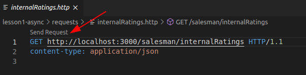

# Lesson 1: Asynchronous Communication

In this lessons you are going to learn the benefits of communicating asynchronously.

## Synchronous vs. Asynchronous

When dealing with multiple software systems or subsystems, like here in integration architectures, the communication can either happen synchronously or asynchronously.
For example when a system calls a REST-API of another system in a synchronous fashion, it means that the calling systems then waits until it receives the response from the called system.
In the meantime, there is nothing else the calling system can do. 
The program is blocked.
When calling a REST-API asynchronously, the calling system specifies, what should be done upon arrival of a response from the called system.
It then continues processing instructions and comes back to the specified behavior when it actually receives a response.

This is much more efficient.
Imagine making breakfast and for every subtask you have to wait until it is completed, before starting the next one.
You have to wait 8 minutes for the eggs to boil.
After that you wait 2 minutes for the coffee to be brewed.
You then wait 3 minutes for the bread to be toasted.
It would take you a lot shorter, if you could make coffee while the eggs are boiling.

In the image below, there is a sequence diagram of synchronous and asynchronous communication.


## Callbacks

A callback is a function, that is passed from a caller to a receiver along with an asynchronous request.
This function instructs the receiver what to do with the result after handling the request.
That way the caller does not have to wait for the result in order to process it.

For the sake of simplicity, we are going to start out with a simple Javascript program, in which asynchronous actions are performed.
Asynchronous communication can not only happen between whole systems, but also between functions.

Open [playground.js](didact://?commandId=vscode.open&projectFilePath=lesson1-async/high-performance/playground.js) and follow along, in order to get a feeling for asynchronous communication.
Click [here](didact://?commandId=workbench.view.debug) to open the Debug Panel. Select *Lesson1: Playground* via the dropdown menu at the top, then click the little green play button next to it.

Consider the built-in function `setTimeout(callback, ms)`.
What it does is this: Wait for the specified amount of milliseconds and then call the specified function.

Read the following code, copy it over to playground.js and run it.
```
let i = 1;

function printAndIncrement() {
    console.log(i);
    i += 1;
}

setTimeout(printAndIncrement, 1000);
setTimeout(printAndIncrement, 1000);
setTimeout(printAndIncrement, 1000);
setTimeout(printAndIncrement, 1000);
```
[COPY](didact://?commandId=vscode.didact.copyToClipboardCommand&text=let%20i%20%3D%201%3B%0A%0Afunction%20printAndIncrement()%20%7B%0A%20%20%20%20console.log(i)%3B%0A%20%20%20%20i%20%2B%3D%201%3B%0A%7D%0A%0AsetTimeout(printAndIncrement%2C%201000)%3B%0AsetTimeout(printAndIncrement%2C%201000)%3B%0AsetTimeout(printAndIncrement%2C%201000)%3B%0AsetTimeout(printAndIncrement%2C%201000)%3B)

It behaves differently than we would at first naively think.
It does not wait and print and increment and wait and print and increment.
Instead it waits for about one second and then prints and increments immediately for four times.
This is due to `setTimeout` behaving asynchronously.
It registers the first callback with a delay of one second and then immediately registers the second callback and so on.

If we want the program to do one thing after another, we would have to write it like this:
```
let i = 1;

function printAndIncrement() {
    console.log(i);
    i += 1;
}

setTimeout(() => {
    printAndIncrement();
    setTimeout(() => {
        printAndIncrement();
        setTimeout(() => {
            printAndIncrement();
            setTimeout(() => {
                printAndIncrement();
            }, 1000);
        }, 1000);
    }, 1000);
}, 1000);
```
[COPY](didact://?commandId=vscode.didact.copyToClipboardCommand&text=let%20i%20%3D%201%3B%0A%0Afunction%20printAndIncrement%28%29%20%7B%0A%20%20%20%20console.log%28i%29%3B%0A%20%20%20%20i%20%2B%3D%201%3B%0A%7D%0A%0AsetTimeout%28%28%29%20%3D%3E%20%7B%0A%20%20%20%20printAndIncrement%28%29%3B%0A%20%20%20%20setTimeout%28%28%29%20%3D%3E%20%7B%0A%20%20%20%20%20%20%20%20printAndIncrement%28%29%3B%0A%20%20%20%20%20%20%20%20setTimeout%28%28%29%20%3D%3E%20%7B%0A%20%20%20%20%20%20%20%20%20%20%20%20printAndIncrement%28%29%3B%0A%20%20%20%20%20%20%20%20%20%20%20%20setTimeout%28%28%29%20%3D%3E%20%7B%0A%20%20%20%20%20%20%20%20%20%20%20%20%20%20%20%20printAndIncrement%28%29%3B%0A%20%20%20%20%20%20%20%20%20%20%20%20%7D%2C%201000%29%3B%0A%20%20%20%20%20%20%20%20%7D%2C%201000%29%3B%0A%20%20%20%20%7D%2C%201000%29%3B%0A%7D%2C%201000%29%3B)

Now we pass a callback function to setTimeout, that prints and increments, and then calls setTimeout, which it passes another callback function, which in turn prints, increments and calls setTimeout with yet another callback function, that does the same, one more time.

As you can imagine, dealing with callbacks in a large codebase can become quite hard to read and understand.
It is even referred to as callback-hell sometimes.

## Promises

This is where Promises enter the stage.
A Promise is an object, which represents the completion of an asynchronous operation.
A Promise can be either pending, fulfilled or rejected.
To construct a Promise, we have to give it an executor function.
Inside this function we write the logic, that determines wether a Promise is fulfilled or rejected.
The executor function takes two arguments, which are again functions.
Let's call the first one `resolve` and the second one `reject`.
These functions are generated by the Promise constructor and you can think of them as a way to mark the outcome of your executor function as successful or failed.
If you call `resolve()`, the Promise is considered fulfilled, if `reject()` is called, the Promise is considered rejected.
If it is fulfilled or rejected, handlers are called, which can be specified by calling `then()` and `catch()` on a Promise object.
The result is also a Promise.
This way we can build Promise chains, which are considerably easier to read than callback pyramids.

Our little example with Promises looks like this:
```
let i = 1;

function printAndIncrement() {
    return new Promise((resolve, reject) => {
        console.log(i);
        i += 1;
        resolve();
    });
}

function sleep() {
    return new Promise((resolve, reject) => {
        setTimeout(resolve, 1000);
    });
}

printAndIncrement()
.then(sleep)
.then(printAndIncrement)
.then(sleep)
.then(printAndIncrement)
.then(sleep)
.then(printAndIncrement)
```
[COPY](didact://?commandId=vscode.didact.copyToClipboardCommand&text=let%20i%20%3D%201%3B%0A%0Afunction%20printAndIncrement()%20%7B%0A%20%20%20%20return%20new%20Promise((resolve%2C%20reject)%20%3D%3E%20%7B%0A%20%20%20%20%20%20%20%20console.log(i)%3B%0A%20%20%20%20%20%20%20%20i%20%2B%3D%201%3B%0A%20%20%20%20%20%20%20%20resolve()%3B%0A%20%20%20%20%7D)%3B%0A%7D%0A%0Afunction%20sleep()%20%7B%0A%20%20%20%20return%20new%20Promise((resolve%2C%20reject)%20%3D%3E%20%7B%0A%20%20%20%20%20%20%20%20setTimeout(resolve%2C%201000)%3B%0A%20%20%20%20%7D)%3B%0A%7D%0A%0AprintAndIncrement()%0A.then(sleep)%0A.then(printAndIncrement)%0A.then(sleep)%0A.then(printAndIncrement)%0A.then(sleep)%0A.then(printAndIncrement))

The `printAndIncrement` function prints, increments and immediately resolves its Promise, signalling the next function in the chain that it is their turn now.
The `sleep` function waits for one second before resolving the Promise.
That way the next function in the chain is not called until after the second has passed.

## Async/Await

The async/await syntax is syntactic sugar for Promises.
It can make asynchronous code look synchronous.
By putting the keyword `async` in front of a function, it automatically returns a Promise.
With the keyword `await` you can wait for a Promise to be fulfilled.
`await` can only be used inside `async` functions.

Our example with async/await looks like this:
```
let i = 1;

function printAndIncrement() {
    console.log(i);
    i += 1;
}

function sleep() {
    return new Promise((resolve, reject) => {
        setTimeout(resolve, 1000);
    });
}

async function main() {
    printAndIncrement();
    await sleep();
    printAndIncrement();
    await sleep();
    printAndIncrement();
    await sleep();
    printAndIncrement();
    await sleep();
};

main();
```
[COPY](didact://?commandId=vscode.didact.copyToClipboardCommand&text=let%20i%20%3D%201%3B%0A%0Afunction%20printAndIncrement()%20%7B%0A%20%20%20%20console.log(i)%3B%0A%20%20%20%20i%20%2B%3D%201%3B%0A%7D%0A%0Afunction%20sleep()%20%7B%0A%20%20%20%20return%20new%20Promise((resolve%2C%20reject)%20%3D%3E%20%7B%0A%20%20%20%20%20%20%20%20setTimeout(resolve%2C%201000)%3B%0A%20%20%20%20%7D)%3B%0A%7D%0A%0Aasync%20function%20main()%20%7B%0A%20%20%20%20printAndIncrement()%3B%0A%20%20%20%20await%20sleep()%3B%0A%20%20%20%20printAndIncrement()%3B%0A%20%20%20%20await%20sleep()%3B%0A%20%20%20%20printAndIncrement()%3B%0A%20%20%20%20await%20sleep()%3B%0A%20%20%20%20printAndIncrement()%3B%0A%20%20%20%20await%20sleep()%3B%0A%7D%3B%0A%0Amain()%3B)

This is basically just an alternative syntax to the Promise chains using `then`.
You can choose whichever one you like best, or whichever one makes your code look simplest.

## Architectural Problem

In the [Salesman Controller](didact://?commandId=vscode.open&projectFilePath=lesson1-async/high-performance/modules/core/server/controllers/salesman.controller.ts) a function is provided, that makes a call to [SalesmanService](didact://?commandId=vscode.open&projectFilePath=lesson1-async/high-performance/modules/core/server/services/salesman.service.ts) in order to retrieve some kind of internal rating for each salesman.
It then logs those ratings, along with the time it took to retrieve them.

[SalesmanService](didact://?commandId=vscode.open&projectFilePath=lesson1-async/high-performance/modules/core/server/services/salesman.service.ts) calls the REST-API of a Customer Relationship Management System, which is already running in the background.
This system apparently takes around one second to come up with a response.

Click [here](didact://?commandId=workbench.view.debug) to open the Debug Panel. Select *Lesson1: High Performance* via the dropdown menu at the top, then click the little green play button next to it. This will start the server application and open a Debug Console.

Then send the request in [internalRatings.http](didact://?commandId=vscode.open&projectFilePath=lesson1-async/requests/internalRatings.http) by clicking [here](didact://?commandId=rest-client.request&projectFilePath=lesson1-async/requests/internalRatings.http&error=Unsuccessful) or by clicking *Send Request* at the top of the editor panel.


You can have a look at the result on the Debug Console.

It takes us around five seconds, to retrieve the internal ratings for five salesmen.
As you can probably imagine, this would not scale very well if we were dealing with hundreds, or even thousands of salesmen.
Let's say, it leaves some room for improvement.

## Architectural Change

What's causing our problem here, is that we are actually not leveraging the power of asynchronous communication.
Right now we are pretty much making synchronous requests to the Customer Relationship Management system.
We want to change our [SalesmanService](didact://?commandId=vscode.open&projectFilePath=lesson1-async/high-performance/modules/core/server/services/salesman.service.ts) to retrieve the internal ratings from the Customer Relationship Management system asynchronously. 

## Get Started!

It is up to you to find out how to do that.
The Tutorial in the beginning of this lesson should help you understand what is going on and what needs to be changed.

**The goal is to get the time down to only around one second.**

Bonus: You can try out how well this scales by calling the REST-API of the CRM system a hundred times, a thousand times, etc.  

**Hint: Instead of waiting for one Promise at a time, you can collect Promises in an array and then get a single Promise that resolves to an array of values, when all of the collected ones have resolved by calling `Promise.all(arrayWithCollectedPromises)`**

## Test your solution

[open a new terminal](didact://?commandId=vscode.didact.startTerminalWithName&text=Tests), change the directory to [lesson1-async/high-performance](didact://?commandId=vscode.didact.sendNamedTerminalAString&text=Tests$$cd+lesson1-async/high-performance) and type [npm t tests/internalRatingsPerformance.test.ts](didact://?commandId=vscode.didact.sendNamedTerminalAString&text=Tests$$npm+t+tests/internalRatingsPerformance.test.ts)