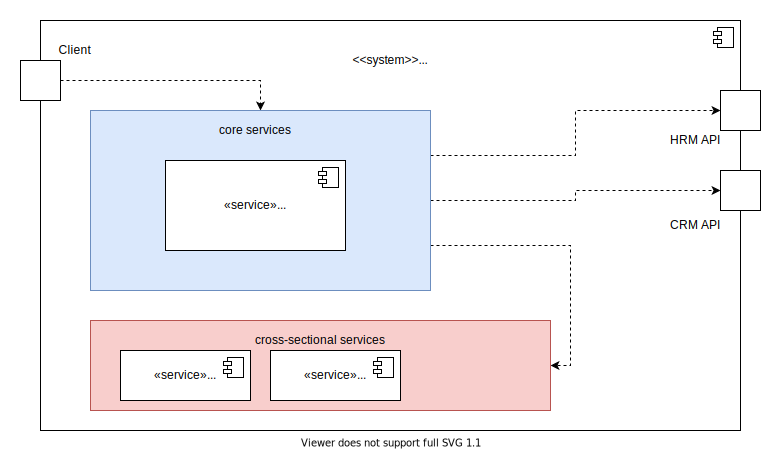
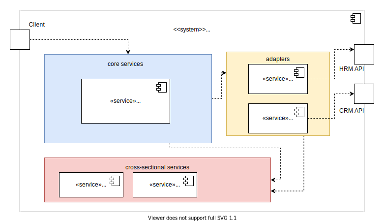

# Lesson 3: Adapters 

In this lesson you are going to learn about why it is good to encapsulate third-party APIs in your own code instead of using them directly.

## Mocking Third-Party Systems

The third-party systems we are trying to communicate with are a human resource management system and a customer relationship management system.
They could for example be located on a company server or in a cloud somewhere off-premise.
Instead of using the real thing, here we will work with mock applications. In our case these are just two small apps that provide REST-APIs similar to the ones the real systems would provide.
This would for example also be done for testing functionality on the developer's machine, when we don't want to mess up 
the real systems. The two mock systems are already running in the background.

You can send Http-Requests to the app from inside the IDE. We prepared one for you that searches for employees named Smith.
Just open the file [employeeSearch.http](didact://?commandId=vscode.open&projectFilePath=lesson3-adapters/requests/employeeSearch.http) and click on the little 'Send Request' button above the Request. A new window will open, that shows the Http-Response, with the JSON data for two employees named Smith. Try changing the search string to 'Sallinger' and rerun the request.

We added another request in the file [bonusSalary.http](didact://?commandId=vscode.open&projectFilePath=lesson3-adapters/requests/bonusSalary.http). What is the biggest difference between the two? Try to send this request and see how the HRM app responds.

Try creating a new .http file and sending a GET Request to `http://localhost:8082/salesOrders` with the query parameter `salesRepId=JSS17`

## Interfacing Third-Party-Systems

Just like we did manually, our high-performance application wants to interface with those third-party APIs as well.

In [BonusComputationService](didact://?commandId=vscode.open&projectFilePath=lesson3-adapters/high-performance/modules/core/server/services/bonusComputation.service.ts), an interface is provided for computing bonus salaries for salesmen.
So far there are two implementations of this interface: [PercentBonusComputationService](didact://?commandId=vscode.open&projectFilePath=lesson3-adapters/high-performance/modules/core/server/services/percentBonusComputation.service.ts) and [MaxOrderComputationService](didact://?commandId=vscode.open&projectFilePath=lesson3-adapters/high-performance/modules/core/server/services/maxOrderBonusComputation.service.ts).

The Strategy for computing the bonuses can be switched in [DependencyInjectionContainer](didact://?commandId=vscode.open&projectFilePath=lesson3-adapters/high-performance/config/dependencyInjectionContainer.ts) by changing the registered service class in line 20.

You can start high-performance in the [Debug Panel](didact://?commandId=workbench.view.debug) via the little green play button or by clicking [here](didact://?commandId=workbench.action.debug.selectandstart) and selecting *Lesson 3: High Performance*.

Our high-performance application also exposes an API. In [high-performance.http](didact://?commandId=vscode.open&projectFilePath=lesson3-adapters/requests/high-performance.http) you can see a GET request to trigger the bonus computation. Doing so will result in high-performance calling both of the third-party APIs.
Send the request and have a look at the response.

## Architectural Problem

Let's have a closer look at [PercentBonusComputationService](didact://?commandId=vscode.open&projectFilePath=lesson3-adapters/high-performance/modules/core/server/services/percentBonusComputation.service.ts).
In line 29 a GET request is made to the CRM system and in line 40 a POST request is made to the HRM system.
Actually that's about to become a problem.
The security department noticed, that anyone was able to access the systems, so they released a new version.

The new secure CRM app is already running on Port 8084. The new HRM app is running on Port 8085. 

Now, every caller of one of the third-party APIs has to get an access token first, by providing the correct password.
then this access token has to be sent with every request.
Have a look at [accessToken.http](didact://?commandId=vscode.open&projectFilePath=lesson3-adapters/requests/accessToken.http) and [secureSalesOrders.http](didact://?commandId=vscode.open&projectFilePath=lesson3-adapters/requests/secureSalesOrders.http).
You have to insert the token, that you get from the first request into the second request, in order to retrieve the sales orders. 

In order to fix our high-performance application, we already have to modify it in four places now.
Still less trouble than changing the architecture, you say?
The problem we are facing can soon become an even bigger problem, as more and more of our business logic code becomes dependent on third-party APIs.
In real-world systems this can lead to issues like our fictitious security problem not being fixed at all.

## Architectural Change

This is where adapters come in handy.
We can change our application from looking something like this:

to looking like this:

From now on, for every API change, the adapter can be modified in one central place.
Our business logic will not require any changes at all.

Create a new module (a folder) and name it lesson3-adapters/high-performance/modules/crmAdapter

Do the same for the HRM system.

Now it's your turn to become active.
Create services and models inside the new adapter modules.
You can use the one of the bonus computation services as orientation.
Write service methods that handle the communication between high-performance and the third-party APIs.
Use these methods in the bonus computation services instead of making requests directly.
You can have the new adapter services injected just by initializing them in the constructors of the bonus computation services.
Don't forget to register them as named services in the [dependency injection container](didact://?commandId=vscode.open&projectFilePath=lesson3-adapters/high-performance/config/dependencyInjectionContainer.ts)

To test your new services, [open a new terminal](didact://?commandId=vscode.didact.startTerminalWithName&text=Tests), change the directory to [lesson3-adapters/high-performance](didact://?commandId=vscode.didact.sendNamedTerminalAString&text=Tests$$cd+lesson3-adapters/high-performance) and type [npm test](didact://?commandId=vscode.didact.sendNamedTerminalAString&text=Tests$$npm+test).
You can also specify the file name of the test, if you just want to run single tests.
The tests in [accessToken.test.ts](didact://?commandId=vscode.open&projectFilePath=lesson3-adapters/high-performance/tests/accessToken.test.ts),[employee.test.ts](didact://?commandId=vscode.open&projectFilePath=lesson3-adapters/high-performance/tests/employee.test.ts) and [salesOrder.test.ts](didact://?commandId=vscode.open&projectFilePath=lesson3-adapters/high-performance/tests/salesOrder.test.ts) are suggestions as to how to structure the adapters.
Feel free to change them to your liking.

*